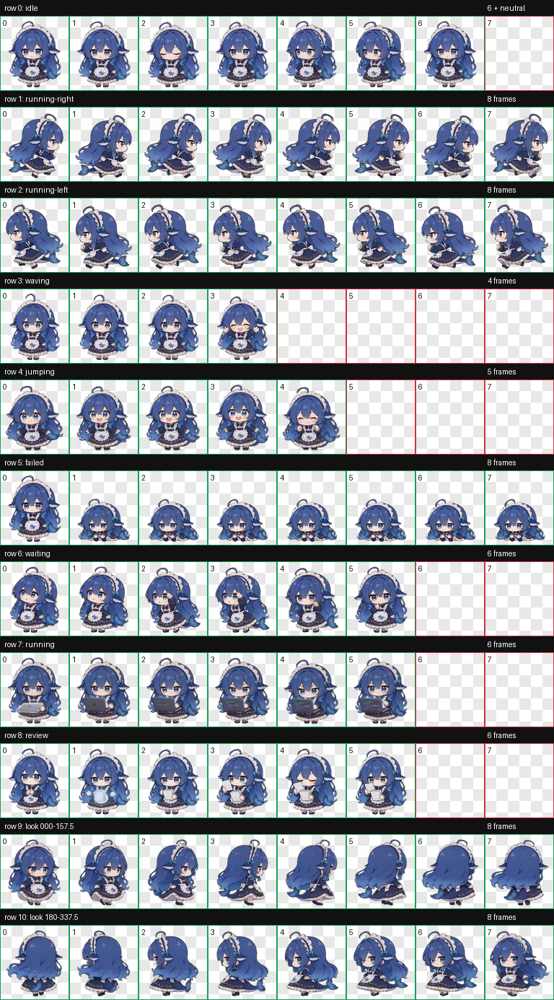

# Blue Whale Maid — Codex Pet

一个适用于 Codex 的蓝鲸小女仆动画宠物，由 `dsh-pet` 项目内已有的透明动画素材转换而成。



## 安装

将本仓库放到 Codex 自定义宠物目录：

```text
~/.codex/pets/blue-whale-maid/
├── pet.json
└── spritesheet.webp
```

重启或重新加载 Codex 后，选择“蓝鲸小女仆”。

## 规格

- Codex sprite version 2
- 8 列 × 11 行
- 每格 192 × 208
- 精灵表 1536 × 2288
- 包含待机、左右奔跑、挥手、跳跃、失败、等待、工作、审查和 16 个观察方向
- 无损 WebP 透明背景

`validation.json` 是 Codex v2 精灵表验证结果；`source-provenance.json` 记录了每行动画对应的原始素材和抽帧时间。

## 素材来源与许可

角色与动画素材来自 [PC2005-cloud/dsh-pet](https://github.com/PC2005-cloud/dsh-pet)。本仓库是该项目的二次创作和格式转换版本，并非原项目官方发布。

依照原项目说明：

- 动画、提示词和源视频允许开源使用，但禁止商用。
- 展示、介绍或分发二创作品时，必须附上原作者 GitHub 地址：<https://github.com/PC2005-cloud/dsh-pet>

详情见 [NOTICE.md](NOTICE.md) 以及原项目当前的许可说明。

